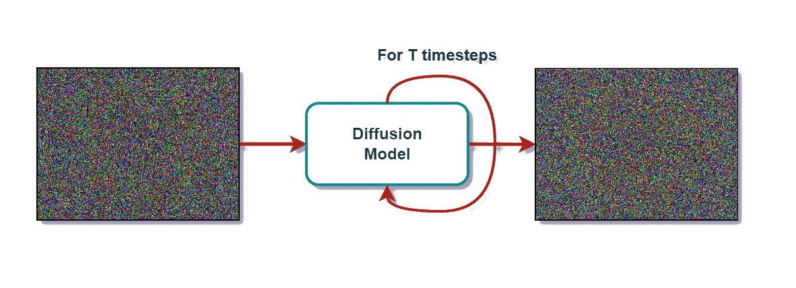
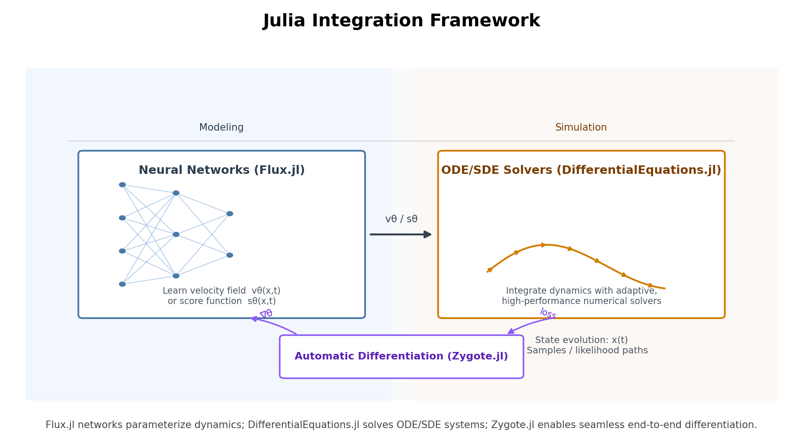
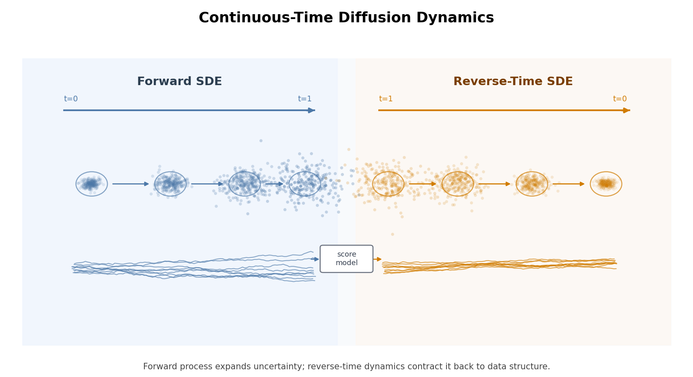
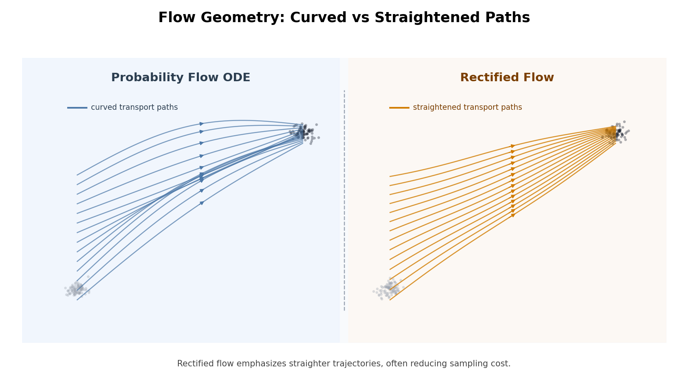
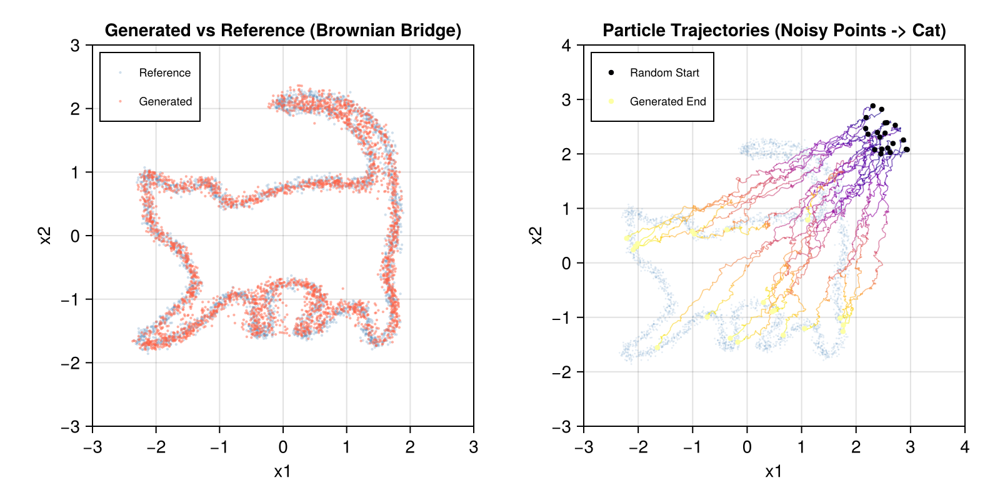
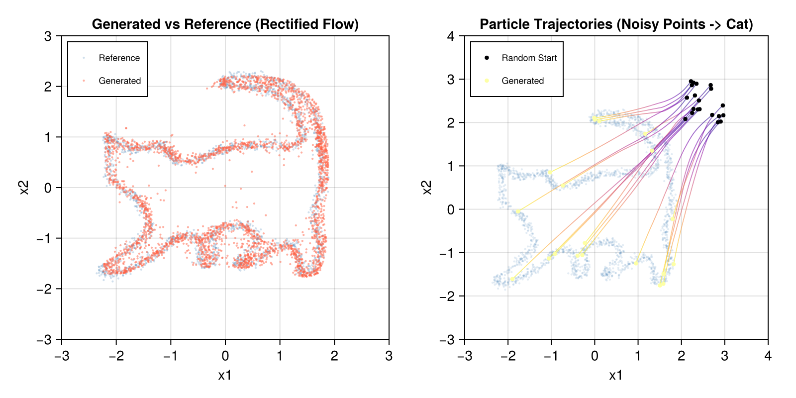

Recent years have witnessed a profound revolution in generative AI, with synthesized content now approaching reality at an astonishing pace. At the heart of this revolution lies a deceptively simple concept: *Data is gradually "drowned" in noise until it becomes completely random, and a neural network learns to "salvage" the original data by reversing this process.*

While this journey began with discrete Denoising Diffusion Probabilistic Models (DDPMs), it has rapidly shifted toward an elegant, differential equation–centric continuous-time mathematical framework: Score-based SDEs and flow-based ODEs like Rectified Flow, which construct deterministic, straight-line ODE trajectories for vastly faster sampling.



### The Expanding Landscape Across Domains

Diffusion models are no longer confined to basic image synthesis; they have evolved into a versatile generative toolkit permeating diverse domains:

- **Visual Generation:** Diffusion Transformers (DiTs) like **FLUX**, **Hunyuan-DiT**, **SD3.5** have set new standards for scalability, while frameworks like **ControlNet**, **T2I-Adapter** enable precise, controllable image and video generation.
- **Language Modeling:** Pioneering explorations demonstrate promise for non-autoregressive, parallel decoding. Models like **LLaDA2.1** and **STAR-LDM** enable novel "draft-then-edit" capabilities, hinting at a unified multimodal future.
- **Scientific Discovery:** In structural biology, models like **Mac-Diff** accelerate protein conformational sampling by 3000×, alongside **AlphaFlow** and **DiG**. In medical imaging, scale-cascaded diffusion is pushing the boundaries of MRI reconstruction.

To support this rapidly expanding landscape, Hugging Face's `diffusers` library has become the undisputed gold standard, dramatically lowering the barrier to entry by wrapping U-Nets, DiTs, ControlNets, and schedulers into a few lines of Python code.

However, this elegant abstraction is a double-edged sword. The act of generating is mathematically equivalent to solving a differential equation (ODE or SDE). By burying these integration steps beneath layers of object-oriented code, the library creates a bottleneck for researchers and engineers who need fine-grained control over the math to optimize speed or accuracy.

### Returning to Mathematical First Principles

If generative modeling is fundamentally about evolving probability distributions via neural-network-driven differential equations, it makes sense to build these models in an environment where differential equations are first-class citizens. This realization led us to Julia. By leveraging Julia's `SciML`/`DifferentialEquations.jl` ecosystem and `Flux.jl` for deep learning, we can strip away the black box and translate continuous-time math directly into executable code.



In this post, we will demonstrate this by implementing three representative diffusion formulations from scratch:

- **VP-SDE** with Euler–Maruyama sampling.
- **Brownian Bridge** as a more stable alternative.
- **Rectified Flow** as an ODE-based straight-line model.

## Fundamentals

Before diving into the code, we must trace the mathematical evolution that underpins modern diffusion models. The progression from discrete DDPM steps to continuous-time SDEs and ODEs is far more than theoretical elegance—it reveals a profound unification. At its core, diffusion models are not merely a bag of tricks for image synthesis; they are a principled framework for learning and manipulating probability distributions.

### The Discrete Origin: DDPMs

Introduced by Sohl-Dickstein et al. (2015) and brought to prominence by Ho et al. (2020), DDPMs defines a forward Markov chain that gradually corrupts data $x_0$ with Gaussian noise over $T$ steps via a variance schedule $\{\beta_t\} $.  A key insight is that the marginal at any timestep admits a tractable closed form via the reparameterization trick:
$$
q(x_t|x_0) = \mathcal{N}(x_t;\ \sqrt{\bar{\alpha}_t}\, x_0,\ (1 - \bar{\alpha}_t) I)
$$
*Here, $\bar{\alpha}_t$ is simply a term derived from $\beta_t$ that dictates the balance between the original image and pure noise.*

The goal of the model is to reverse this corruption. We train a neural network $\epsilon_\theta(x_t, t)$ to look at a noisy image $x_t$ and guess the exact noise $\epsilon$ that was added.The training objective is an elegantly simple Mean Squared Error:
$$
\mathcal{L} = \mathbb{E}_{t, x_0, \epsilon}\left[\|\epsilon - \epsilon_\theta(x_t, t)\|^2\right]
$$
At inference, $p_\theta $ recovers $x_{t-1} $ by first estimating $\hat{x}_0 = \frac{1}{\sqrt{\bar{\alpha}_t}}(x_t - \sqrt{1-\bar{\alpha}_t}\,\epsilon_\theta) $, then sampling from the posterior:
$$
p_\theta(x_{t-1}|x_t) = \mathcal{N}(x_{t-1};\ \mu_\theta(x_t, t),\ \tilde{\beta}_t I)
$$

$$
\mu_\theta(x_t, t) = \frac{1}{\sqrt{\alpha_t}}(x_t-\frac{\beta_t}{\sqrt{1-\bar{\alpha_t}}}\epsilon_\theta(x_t, t))
$$

Despite achieving high sample quality, iterative denoising over ~1000 steps is computationally expensive at inference. DDIM (Song et al., 2020) alleviates this bottleneck by formulating the reverse process as a deterministic non-Markovian mapping, reducing sampling steps by an order of magnitude without retraining. More importantly, the discrete formulation obscures the underlying continuous-time limit, whose clarification unlocks a much richer mathematical framework.

### Moving to Continuous Dynamics: Score-Based SDEs

What happens if we shrink the time between those discrete steps closer and closer to zero ($\Delta t \to 0 $)? The clunky Markov chain elegantly transforms into a continuous-time Stochastic Differential Equation (SDE). Song et al. (2021) showed that almost all diffusion models can be unified under this framework. Instead of discrete jumps, the forward noise process becomes a smooth flow described by:
$$
dx = -\frac{1}{2}\beta(t)x\,dt + \sqrt{\beta(t)}\,dw
$$
*Here, $dt$ represents the flow of time, $dw $ represents standard Brownian motion (the continuous injection of random noise) and $\beta(t)$ is a continuous noise schedule.*

### Turning Back Time: The Reverse SDE and the Score Function

The true magic of SDEs is that for any forward process, an exact mathematical "rewind" button exists. The reverse process looks like this:
$$
dx = \left[-\frac{1}{2}\beta(t)x - \beta(t)\nabla_x \log p_t(x)\right]dt + \sqrt{\beta(t)}\,d\bar{w}
$$

The most critical component here is $\nabla_x \log p_t(x)$—known as the **score function**. Conceptually, you can think of the score function as a compass: it constantly points the noisy data toward regions where real, clean data is more likely to exist. Just like DDPM trained a network to predict noise, we can train a network to act as this compass.



### From Randomness to Certainty: Probability Flow ODE

The reverse SDE generates samples via a score-guided drift corrupted by Brownian noise $d\bar{w}$. However, Song et al. (2021) proved this randomness is strictly optional. For any diffusion SDE, there exists a unique, deterministic Ordinary Differential Equation (ODE) that induces the exact same marginal distributions $p_t(x)$:
$$
dx = \left[-\frac{1}{2}\beta(t)x - \frac{1}{2}\beta(t)\, s_\theta(x, t)\right] dt
$$
By discarding the stochastic term entirely and halving the score coefficient, we obtain the **Probability Flow ODE**. Integrating this ODE backward in time (from noise at $t=1$ to data at $t=0$) yields a clean sample along a remarkably smooth path.

This formulation carries two profound consequences. First, it reframes generation as a pure numerical integration problem, solvable with off-the-shelf ODE solvers using significantly fewer steps than DDPMs' 1000-step chain. Second, it establishes a bijective mapping between noise and data, enabling exact likelihood computation and seamless latent manipulation (with DDIM acting as an early discrete approximation).

### Train a Flow-Based Diffusion: Flow Matching and Rectified Flow

Lipman et al. (2022) and Liu et al. (2022) independently introduced Flow Matching and **Rectified Flow**. They proposed directly regressing a neural network $v_\theta $ onto a target vector field connecting noise $x_{\text{noise}}$ to data $x_{\text{data}}$. By defining a simple linear interpolation $x_t = t\,x_{\text{noise}} + (1-t)\,x_{\text{data}}$ (where time $t$ flows from $1$ to $0$, mirroring the reverse-SDE convention), the training objective becomes elegantly straightforward:
$$
\mathcal{L}_{\text{Flow}} = \mathbb{E}_{t, x_{\text{data}}, x_{\text{noise}}}\left[\|v_\theta(x_t, t) - (x_{\text{noise}} - x_{\text{data}})\|^2\right]
$$
The key insight here is that straight-line trajectories are not just computationally convenient—they are optimal. Linear paths have zero curvature, requiring drastically fewer neural function evaluations (NFEs) to integrate accurately. Rectified Flow further introduced Reflow, an iterative procedure that re-trains the model on its own generated pairs to continuously straighten the trajectories toward a one-step mapping. This philosophy—direct vector field regression on straight paths—has now cemented itself as a training paradigm, powering state-of-the-art models



Having established the mathematical foundations, we now turn to their concrete realization in Julia—where each of these differential equations becomes a first-class computational object.

## Julia Implementation

### SDE-Based Diffusion: from VP-SDE to Brownian Bridge

We implement two SDE-based models, progressing from the classical VP-SDE baseline to the more stable Brownian Bridge formulation. The time convention here follows $t=1$ (noise) $\to$ $t=0$ (data), mirroring the reverse-time SDE formulation from Part 2, but reverting to the original formulations in the foundational papers on flow-based diffusion.

#### Baseline: VP-SDE

The VP-SDE directly translates the Song et al. (2021) continuous-time framework into code.

**1. Noise schedule:**

A linear $\beta(t) $ schedule defines the instantaneous diffusion rate. The marginal statistics $\alpha(t) $ and $\sigma(t) $ are derived analytically, enabling direct closed-form sampling at any $t$:

```julia
beta_fn(t)     = BETA_MIN + t * (BETA_MAX - BETA_MIN)
alpha_fn(t)    = exp(-0.5f0 * (BETA_MIN * t + 0.5f0 * (BETA_MAX - BETA_MIN) * t^2))
sigma_fn(t)    = sqrt(max(1f0 - alpha_fn(t)^2, 1f-8))
```

**2. Forward process**

The perturbation kernel is sampled in one shot—no iterative chain required. The added noise $\varepsilon$ is retained as the training target:

```julia
function vpsde_forward(x0, t)
    at = reshape(alpha_fn.(Float32.(t)), :, 1) |> DEVICE
    st = reshape(sigma_fn.(Float32.(t)), :, 1) |> DEVICE
    ε  = randn!(similar(x0))
    return at .* x0 .+ st .* ε, ε
end
```

**3. Neural Network**

The backbone is a residual MLP with two independent branches—a sinusoidal time embedding and a spatial state embedding—fused by addition before the residual layers. This design is shared by both the SDE and ODE implementations, reflecting modern DiT-style architectures.

```julia
struct Net
    time_embed  :: Dense # sinusoidal features -> hidden
    state_embed :: Dense # x_t                 -> hidden
    res         :: Vector{Dense}
    decode      :: Dense
end

function (m::Net)(te, xt)
    h = m.time_embed(te) .+ m.state_embed(xt)
    for layer in m.res
        h = h .+ layer(h)
    end
    return m.decode(h)
end
```

The sinusoidal time embedding maps scalar $t$ to a $32$-dimensional vector via multi-scale $\sin/\cos$ frequencies, allowing the network to resolve fine temporal structure near the critical region $t \approx 0.5$:

```julia
function t_embed(t::AbstractVector)
    te = reshape(t, :, 1) .* reshape(FREQS, 1, :)
    return hcat(sin.(te), cos.(te))
end
```

**4. Training**

The network $\epsilon_\theta(x_t, t)$ predicts the added noise via a plain MSE, which is equivalent to denoising score matching under a $\lambda(t) = \sigma^2(t)$ weighting:

```julia
loss, grads = Flux.withgradient(model) do m
    x_t, ε  = vpsde_forward(x0, t)
    ε_pred  = model_forward(m, x_t, t)
    mean((ε_pred .- ε).^2)
end
```

**5. Reverse SDE (Euler-Maruyama)**

The score is recovered via $s_\theta = -\epsilon_\theta / \sigma(t)$, then substituted into the discretized reverse SDE from Part 2. The stochastic term is dropped at the final step ($i=1$) to avoid injecting noise at the data boundary:

```julia
β     = beta_fn(t_val)
score = -model_forward(model, x, t_vec) ./ sigma_fn(t_val)
drift = (β/2f0 .* x .+ β .* score) .* dt
noise = i > 1 ? sqrt(β * dt) .* randn!(similar(x)) : zero(x)
x     = x .+ drift .+ noise
```

The figure below shows 3000 generated samples overlaid on the reference cat outline (left) and several particle trajectories from noise to data (right)—the curved, reflect the stochastic paths in the reverse SDE. While the VP-SDE produces correct samples, convergence is slow: the $\beta(t)$ schedule must be tuned carefully, the score magnitude varies over several orders of magnitude across $t \in [0,1]$, and 200 Euler-Maruyama steps are needed for acceptable quality. This motivates the Brownian Bridge reformulation below.


> The cat outline function refers to <https://www.geogebra.org/m/pH8wD3rW>: "A Parametric Cat".
>

#### Improved: Brownian Bridge

We implement a **Brownian Bridged** model. The Brownian Bridge provides an exact, closed-form interpolation with noise that naturally vanishes at both endpoints—eliminating schedule tuning and dramatically stabilising convergence.

**1. Forward Process**

The forward process corrupts data $x_0$ toward noise $x_1$ following the Brownian Bridge law. The noise amplitude $\sigma\sqrt{t(1-t)}$ reaches its maximum at $t=0.5$ and collapses to zero at both endpoints, naturally pinning the endpoints without any boundary condition enforcement :
$$
x_t = (1-t)\,x_0 + t\,x_1 + \sigma\sqrt{t(1-t)}\,\varepsilon, \quad \varepsilon \sim \mathcal{N}(0,I)
$$

```julia
function bridge_forward(x_data, x_noise, t)
    t_f = reshape(Float32.(t) |> DEVICE, :, 1)
    st  = σ_BRIDGE .* sqrt.(t_f .* (1f0 .- t_f))
    ε   = randn!(similar(x_data))
    return (1f0 .- t_f) .* x_data .+ t_f .* x_noise .+ st .* ε
end
```

**2. Training**

The model is trained to directly predict the data endpoint $\hat{x}_0 = f_\theta(x_t, t)$, rather than the velocity or noise. A time-dependent loss weight $\frac{1}{(t+0.05)^2}$ up-weights samples near $t=0$ (the data boundary) where prediction error is most consequential:

```julia
loss, grads = Flux.withgradient(model) do m
    xt      = bridge_forward(x_data, x_noise, t)
    x0_pred = model_forward(m, xt, t)
    scale   = reshape(1f0 ./ (Float32.(t) .+ 0.05f0).^2 |> DEVICE, :, 1)
    mean(scale .* (x0_pred .- x_data).^2)
end
Flux.update!(opt_state, model, grads[1])
```

Here the `model_forward` wraps the network with an external residual: $\hat{x}_0 = x_t + \Delta(t)\cdot(t + 0.05)$, so the correction $\Delta(t)$ learned by the MLP tends smoothly toward zero as $t \to 0$, where $x_t \approx x_0$ already.

**3. Reverse Sampling**

The reverse sampling uses the **exact conditional distribution** of a Brownian Bridge. Given the current state $x_{t_1}$ and the model's prediction $\hat{x}_0$, the next state at $t_2 < t_1$ is drawn from:

$$
x_{t_2} \sim \mathcal{N}\!\left(\frac{t_1-t_2}{t_1}\hat{x}_0 + \frac{t_2}{t_1}x_{t_1},\; \sigma^2\frac{t_2(t_1-t_2)}{t_1}I\right)
$$

```julia
function bridge_step(x_t, x0_hat, t1, t2)
    c_x0 = (t1 - t2) / t1
    c_xt = t2 / t1
    std  = σ_BRIDGE * sqrt(max(t2 * (t1 - t2) / t1, 0f0))
    noise = std > 0f0 ? std .* randn!(similar(x_t)) : zero(x_t)
    return c_x0 .* x0_hat .+ c_xt .* x_t .+ noise
end
```

Compared with the naive VP-SDE in the previous section, the carefully designed Brownian Bridge forward enables the model to learn a denoising trajectory that is more convergent yet does not lose randomness.



### ODE-Based Diffusion with Rectified Flow

We implement **Rectified Flow** (Liu et al., 2022) whose key philosophy: instead of learning a score function to drive a stochastic reverse SDE, we directly regress a neural network $v_\theta $ onto the **constant target velocity** of each specific straight-line trajectory. The resulting ODE has near-zero curvature, enabling accurate integration with very few steps.

**1. Forward Process**

The interpolation path is purely linear—no noise schedule, no $\alpha_t$, no $\beta_t$:

$$
x_t = t\,x_\text{noise} + (1-t)\,x_\text{data}
$$

```julia
function interp(x_data, x_noise, t)
    t_ = reshape(t, :, 1)
    return t_ .* x_noise .+ (1f0 .- t_) .* x_data
end
```

**2. Training**

The target velocity is simply $v^* = x_\text{noise} - x_\text{data}$—a constant for any given pair. The loss is a plain MSE (no ELBO derivation, no score matching) between the network's prediction and this constant:

$$
\mathcal{L} = \mathbb{E}\left[\|v_\theta(x_t, t) - (x_\text{noise} - x_\text{data})\|^2\right]
$$

```julia
loss, grads = Flux.withgradient(model) do m
    x_t    = interp(x_data, x_noise, t)
    v_pred = model_forward(m, x_t, t)
    v_true = x_noise .- x_data
    mean((v_pred .- v_true).^2)
end
Flux.update!(opt_state, model, grads[1])
```

**3. Reverse ODE (Euler-Maruyama)**

```julia
for i in 0:n_steps-1
    fill!(t_vec, 1f0 - Float32(i) / Float32(n_steps))
    v = model_forward(model, x, t_vec)
    x = x .- dt .* v
end
```

Below, we see 3000 samples recovering the cat geometry (left) and 20 trajectories tracing the generative path (right). After 8000 steps of Rectified Flow training, the magic is clear: compared to the erratic SDE trajectories, these paths are almost perfectly straight—the unmistakable hallmark of a rectified velocity field at work.



### Discussion on Sampling

We will use our trained Rectified Flow model as the primary testbed for this exploration.

Because Rectified Flow explicitly minimizes trajectory curvature, it enables generation in just 20–100 steps—a massive leap from DDPM’s 1000-step Markov chain. However, the final generation quality is fundamentally bound by two remaining sources of error:

1. **Model Fitting Error**: How accurately our neural network $v_\theta$ approximates the true velocity field.

2. **Solver Discretization Error**: The truncation error accumulated by the numerical integrator at each step.

Techniques like **Reflow** attempt to mitigate discretization error by re-training the model to further straighten trajectories. But this incurs the massive overhead of a completely new training run.

Instead of paying the cost of retraining, we want to tackle this purely from an engineering and numerical perspective. Assuming the model's fitting error is fixed, how can we find the optimal trade-off between solver discretization error and computational cost (NFEs)?

By leveraging Julia's `OrdinaryDiffEq.jl` ecosystem, we will explore whether simply dropping in **higher-order** or **adaptive-step** solvers can squeeze out more accurate trajectory approximations without expanding our NFE budget.

#### Samplers or Solvers

**1. Euler (1st-order, fixed step)**

One model call per step, $O(h)$ local truncation error.

**2. Heun (2nd-order, fixed step)**

Predictor-corrector with two model calls per step; trapezoidal average halves the error at the same step count.

```julia
k1 = model_forward(model, x,             t_vec0)
k2 = model_forward(model, x .- dt .* k1, t_vec1)
x  = x .- (dt / 2f0) .* (k1 .+ k2)
```

**3. Tsit5 (4th/5th-order, adaptive step)**

Here we drop the manual for-loop completely. We register the velocity network as a standard `ODEProblem` right-hand side and let Tsitouras' (2011) embedded RK45 solver control the step size automatically—densifying near high-curvature regions and coarsening where the field is smooth:

```julia
function f!(du, u, p, t)
    fill!(t_vec, Float32(t))
    du .= model_forward(model, u, t_vec)
    p[] += 1
end

prob = ODEProblem(f!, x0, (1f0, 0f0), nfe)
sol  = solve(prob, Tsit5(); abstol=abstol, reltol=reltol, save_everystep=false)
```

Instead of setting a fixed step count, we control Tsit5 using two tolerance parameters:

- `abstol` (Absolute Tolerance): Bounds the absolute local error per step.

- `reltol` (Relative Tolerance): Bounds the error relative to the current solution magnitude.

If the estimated error exceeds these tolerances, the solver rejects the step, shrinks the step size ($h$), and tries again. Tighter tolerances force more (and smaller) steps, increasing the NFE, while looser tolerances allow the solver to take massive strides.

#### Samplers Summary

| Sampler | Steps | NFE | Key property |
|---------|-------|-----|-------------|
| **Euler** | $N$ | $N$ | 1st-order, $O(h)$ local error |
| **Heun** | $N$ | $2N$ | 2nd-order, $O(h^2)$ local error, trapezoidal corrector |
| **Tsit5 (fixed step)** | $N$ | $\sim 6N$ | 4th-order, fixed step size, higher accuracy per step |
| **Tsit5 (adaptive)** | auto | tol-dependent | 4th/5th-order, error-controlled; NFE matches compute budget set by tolerance |

#### Experiments and Results

To create a fair comparison against fixed-step solvers, we empirically pair each target step-count baseline ($N$) with a matching tolerance for Tsit5 ($N=10 \!\to\! 5{\times}10^{-2}$, $N=20 \!\to\! 10^{-2}$, $N=50 \!\to\! 10^{-3}$, $N=100 \!\to\! 5{\times}10^{-4}$). This ensures the adaptive NFE stays roughly within the same compute budget as our baselines.

The final results are listed as follow:

| Compute Budget | Sampler | NFE | CD ↓ | MMD² ↓ | Note |
|:---|:---|---:|---:|---:|:---|
| **Ultra-Low (≤20)** | Euler (10 steps) | **10** | 0.0830 | 0.012648 | Too coarse, high error |
| | Heun (10 steps) | 20 | **0.0619** | **0.003062** | **Best performance/cost ratio** |
| | Euler (20 steps) | 20 | 0.0664 | 0.005444 | Beaten by Heun-10 at same NFE |
| **Medium (40~100)** | Heun (20 steps) | **40** | 0.0607 | 0.004016 | Reaching model capacity |
| | Tsit5-adaptive | 49 | **0.0594** | **0.002823** | Adaptive (tol = 5×10⁻²) |
| | Tsit5-fixed | 61 | 0.0609 | 0.003463 | Fixed (10 steps) |
| | Tsit5-adaptive | 97 | 0.0590 | 0.004770 | Adaptive (tol = 1×10⁻²) |
| | Euler (100 steps)| 100 | 0.0583 | 0.002840 | |
| **High (≥100)** | Heun (50 steps) | 100 | 0.0606 | 0.004314 | Diminishing returns |
| | Tsit5-fixed | 121 | **0.0577** | **0.002795** | Fixed (20 steps) |
| | Tsit5-adaptive | 289 | 0.0586 | 0.002570 | Adaptive (tol = 1×10⁻³) |

> **Metrics:**
>
> - **CD (Chamfer Distance) ↓** — measures geometric fidelity between the generated point cloud and ground truth. For two sets $A$ and $B$, $\text{CD} = \operatorname{mean}_i(\min_j \|a_i - b_j\|) + \operatorname{mean}_j(\min_i \|a_i - b_j\|)$. It captures both *precision* (how close each generated point is to the nearest real point) and *recall* (how well the real distribution is covered). Lower is better.
> - **$\text{MMD}^2$ (Maximum Mean Discrepancy) ↓** — measures distributional similarity using an RBF kernel $k(x,y) = \exp\left(-\frac{\|x-y\|^2}{2\sigma^2}\right)$ with $\sigma = 0.5$: $\text{MMD}^2 = \mathbb{E}[k(a,a)] - 2\mathbb{E}[k(a,b)] + \mathbb{E}[k(b,b)]$. It equals $0$ for identical distributions and is sensitive to mode collapse or distributional mismatch. Lower is better.

The data from our Julia-powered ODE solver benchmarks reveals several profound insights for deploying Flow-based models in practice:

**1. Mathematical Order Beats Brute-Force Steps (The Heun Sweet Spot)**

When the computational budget is tight, simply taking more steps is highly inefficient. A 2nd-order solver like Heun at just 10 steps easily beats a basic 1st-order Euler solver at 20 steps because it elegantly corrects for slight trajectory curvatures. For practical deployment, Heun with 10–20 steps offers the ultimate performance-to-cost ratio.

**2. The Invisible Ceiling: Model Error vs. Solver Error**

Notice how the Chamfer Distance (CD) stubbornly plateaus around `0.058` - `0.060`, regardless of whether we use Heun with 100 NFEs or the highly precise Tsit5 with 500+ NFEs. This perfectly illustrates our initial hypothesis: once the solver discretization error is pushed below a certain threshold, the **Model Fitting Error** becomes the sole bottleneck. Throwing heavier numerical solvers at the problem yields rapidly diminishing returns if the neural network itself has reached its capacity.

**3. The True Value of Adaptive Solvers (`Tsit5`)**

While adaptive solvers like `Tsit5` are computationally "overkill" for everyday image generation, they are unparalleled research tools. Instead of relying on blind trial and error to guess the best step sizes, it mathematically discovers the exact optimal step distribution for us. It acts as a "microscope," allowing researchers to establish a rigorous, ground-truth baseline of the model's behavior without retraining.

## What Can Julia Do and Where Are Its Limits?

Our journey from implementing VP-SDE to Brownian Bridge and Rectified Flow reveals that modern diffusion is fundamentally about learning vector fields and integrating them accurately. Building this entirely in Julia rather than standard Python frameworks provided unique insights into the models' dynamics, but also exposed clear practical boundaries.

### What Julia Excels At: A Generative Dynamics Sandbox

Julia's true value lies in exposing the differential-equation core of generative modeling, rather than hiding it behind object-oriented pipelines. By unifying the neural network (`Flux.jl`) and the integrator (`DifferentialEquations.jl`), Julia serves as a transparent sandbox:

- **Seamless Formulation Swapping:** It allowed us to directly observe how formulation dictates trajectory stability—from the high-curvature paths of the baseline VP-SDE, to the naturally pinned endpoints of the Brownian Bridge, and finally to the highly efficient, straight-line ODE trajectories of Rectified Flow.
- **Rigorous Solver Analysis:** Instead of blind trial and error, Julia's `SciML` ecosystem let us easily drop in different numerical methods. This led directly to our key benchmark findings: higher-order methods (like Heun) offer vastly better performance-to-cost ratios than brute-force 1st-order solvers (like Euler) under tight computational budgets. It also helped us identify the "model error bottleneck"—demonstrating that once a robust solver reduces discretization error, throwing heavier numerical integration at the problem yields diminishing returns due to the neural network's own capacity limits.

### Where Its Limits Are: The Production Reality

Despite its mathematical elegance, Julia is not a free lunch and faces significant hurdles for production-oriented Generative AI workflows:

- **Ecosystem and Tooling:** Python's `PyTorch` and `diffusers` ecosystem remains vastly superior for accessing large-scale pretrained foundation models, LoRA tooling, and community-driven pipelines.
- **Deployment and Latency:** Julia's JIT compilation introduces startup overhead that is less ideal for fast, interactive inference, making Python the more battle-tested choice for enterprise deployment.
- **Model Persistence and Serialization:** Saving and loading model weights in Julia (e.g., via `BSON.jl` or `JLD2.jl`) is less standardized and often more brittle than Python's robust `state_dict` or `safetensors`. This lack of a unified serialization format makes checkpoint management and cross-platform sharing a recurring pain point.

## Takeaways

Our implementation demonstrates that Julia's `SciML` ecosystem is highly effective for exposing the mathematical core of diffusion models. By framing generation purely as solving differential equations, we can easily swap solvers (e.g., Euler, Heun, Tsit5) and directly evaluate integration dynamics. However, Python currently maximizes ecosystem breadth and deployment convenience.

The most promising next step is **co-design**: optimize training objectives, parameterizations, and samplers jointly rather than in isolation. Concretely, future work could explore:

1. **Solver-aware training:** Train and optimize directly for low-NFE high-order integration.
2. **Curvature-regularized sampling:** Design an adaptive sampler for one/few-step generation without full retraining cycles by assigning sampling density to different curvatures on the path.
3. **Integrating Classifier-Free Guidance:** Introduce conditions to the network, enabling output guided by manual conditional input, thus getting closer to modern diffusion applications.
4. **Cross-framework pipelines** Train and fine-tune models at scale in `PyTorch`, analyze and optimize dynamics in Julia.

## Reference

1. Ho, J., Jain, A., & Abbeel, P. (2020). Denoising Diffusion Probabilistic Models. *NeurIPS*.
2. Song, Y., Sohl-Dickstein, J., Kingma, D. P., Kumar, A., Ermon, S., & Poole, B. (2021). Score-Based Generative Modeling through Stochastic Differential Equations. *arXiv:2011.13456*.
3. Liu, X., Gong, C., & Liu, Q. (2022). Flow Straight and Fast: Learning to Generate and Transfer Data with Rectified Flow. *arXiv:2209.03003*.
4. Song, J., Meng, C., & Ermon, S. (2023). Denoising Diffusion Implicit Models.
5. Black Forest Labs. (2025). FLUX.1: A 12B Parameter Rectified Flow Transformer. *Technical Report*.
6. Hunyuan Team. (2024). Hunyuan-DiT: A Powerful Multi-Resolution Diffusion Transformer. *Technical Report*.
7. Stability AI. (2024). Stable Diffusion 3.5: Scaling Diffusion Transformers for High-Fidelity Image Generation. *Technical Report*.
8. Zhang, L., et al. (2023). Adding Conditional Control to Text-to-Image Diffusion Models. *arXiv:2302.05543*.
9. Mou, C., et al. (2024). T2I-Adapter: Learning Adapters to Dig out More Controllable Ability for Text-to-Image Diffusion Models. *arXiv:2302.08453*.
10. Hu, Y., et al. (2025). MHDAUNet: Dual-Path Noise Alignment for Controllable DiT Generation. *CVPR 2025*.
11. InclusionAI. (2026). LLaDA2.1 Technical Report. *arXiv:2602.08676*.
12. Lovelace, J., et al. (2026). Stop-Think-AutoRegress: Language Modeling with Latent Diffusion Planning. *arXiv:2602.20528*.
13. Xiang, Z., et al. (2025). Mac-Diff: Conditional Diffusion for Protein Conformational Ensembles. *Nature Methods* (in press).
14. Algassim, H., et al. (2024). AlphaFlow: Learning to Sample Protein Conformations. *ICLR 2024*.
15. Zheng, S., et al. (2024). DiG: Diffusion Model for Protein Conformational Sampling. *NeurIPS 2024*.
16. Kazerouni, A., et al. (2023). Diffusion Models in Medical Imaging: A Comprehensive Survey. *Medical Image Analysis*.
17. Kawar, B., et al. (2025). Scale-Cascaded Diffusion Models for MRI Super-Resolution. *IEEE TMI*.

## Generative AI Usage

We used `Claude Code` as an assistant in code implementation. It helps us fix bugs and optimize some logic, but we will not directly use the entire generated code as our implementation. In writing the Blog, we used `Gemini 3.1 Pro`, which helps us optimize wording and convert Latex formats. Similarly, we will not directly use entire paragraphs generated by Gemini to replace our own thinking and efforts. All content we write or implement has undergone strict review.

## Contributions

- **Cao Zhijun (A0318149Y):**  Implemented core code for DDPM, SDE-based, and ODE-based models. Analyzed the performance of different samplers and polished the final blog content.
- **Chen Pinhong (A0318243J):** Created all project visualizations and diagrams. Wrote the first draft of the model principles section and conducted literature research.
- **Huang Zifeng (A0329302M):** Developed the blog website from scratch. Participated in mathematical derivations and code implementation discussions.
- **Rui Shuzhe (A0327037H):** Toke part in writing the introduction and background sections. Organized the reference list and performed final proofreading and editing of the blog.
- **Wang Xiao (A0331694Y):** Implemented exploratory code for conditional diffusion and organized the project’s GitHub repository.
